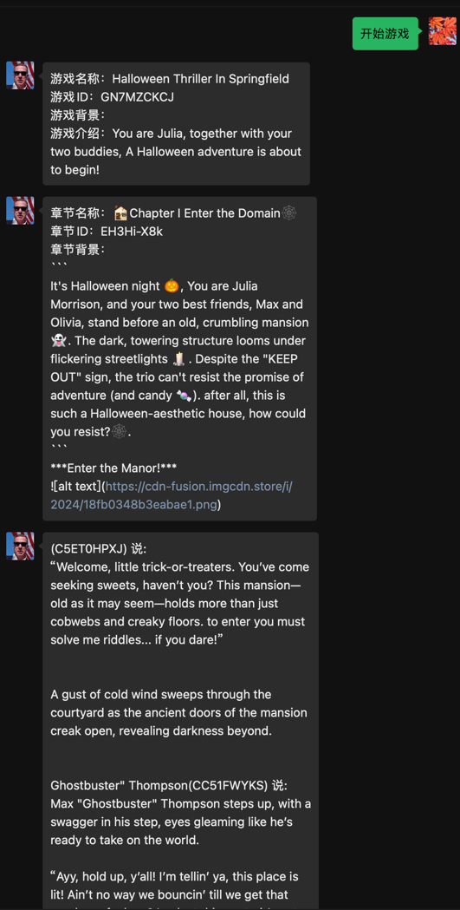

# WeChatRpg

## 使用须知
1、仅适用于Windows x86架构，不适用于任何架构的MacOS（微信版本不支持&Hook库不支持）

2、微信版本必须为3.9.5.81，安装后启动时提示版本过低不要理会，直接运行代码，下方给你该版本微信的下载链接

3、Python版本=3.9.13，小版本不限，大于该版本理论上可行，小于该版本的未经测试

4、可能会有封微信号的副作用，请谨慎使用，或者自己找个小号

5、ADMIN_WE_CHAT_ID只是临时测试用的，可以改成你自己的

6、注意、代码中会监测所有的聊天记录，尚未做单个处理，即使你从别的群里收到的消息，也会发给admin

## 已知问题
1、很多、、、待补充


## 使用方法
```shell
pip install wxhook
python main.py
```

附带一个该版本微信EXE安装包Link：

```
https://github.com/tom-snow/wechat-windows-versions/releases/download/v3.9.5.81/WeChatSetup-3.9.5.81.exe
```

测试图，目前仅限于开始游戏：

